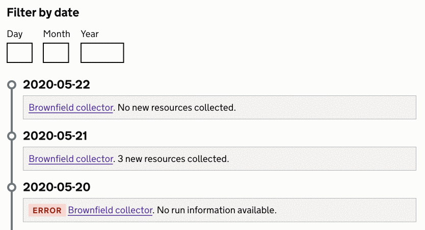

# Timeline

Use the timeline component to show an ordered record of what has happened.

{{ designSystemExample({
"iframe": {
    "title": "An example of the timeline component",
    "url": "example.html",
    "size": "l"
},
"component": {
    "name": "timeline"
}
}) }}

## Filtering a timeline

The timeline component can be progressively enhanced to allow filtering by date.

We add this enhancement when the timeline has many entries and a user might need to find a specific one. An example of that can be seen on a [collection log page](https://digital-land.github.io/collection/brownfield-land/log/).

### Collector log example

The timeline component is good to use when you are showing a sequence of log entries.

{{ designSystemExample({
"iframe": {
    "title": "An example of the timeline component",
    "url": "example-collector.html",
    "size": "l"
},
"component": {
    "name": "timeline"
}
}) }}

When the timeline has many entries you can use the `call` approach to generate the entries individually or via a loop.

## Research on this compponent

We need to do more research on this component. If you have used the timeline component, get in touch to share your research findings.

We will keep an eye on other services that use the timeline and hopefully get a better inderstanding of how timelines are being used across government. For example, it is used by [MoJ](https://moj-design-system.herokuapp.com/components/timeline).